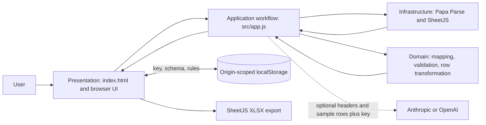

# Architecture and security decisions

## Scope and system context

DataBridge is a static browser application. It has no application server, identity service, or database. Source file bytes remain in the tab. Optional AI mapping transmits headers and a small sample of row data to exactly one selected AI provider.

## Components and boundaries

| Component | Responsibility | Data boundary |
| --- | --- | --- |
| `index.html` | Page shell, styles, static library references, CSP | Static presentation only |
| `src/app.js` | Browser state, event wiring, workflow orchestration, view rendering | Owns transient files and result rows |
| Domain functions in `src/app.js` | Required-field/rule validation, mapping, transformation, export selection | Pure row-level decisions where practical |
| `vendor/papaparse.min.js` | CSV and text parsing | Runs locally in the browser |
| `vendor/xlsx.full.min.js` | XLS/XLSX parsing and XLSX export | Runs locally in the browser |
| Browser `localStorage` | Key, provider, schema, and rule persistence | Plaintext, scoped to the site origin and browser profile |
| Provider API | Optional assisted mapping | Receives key, headers, and up to three sample rows over HTTPS |

The current MVP keeps application and domain functions together in one browser module to preserve its no-build distribution. A future expansion can separate `domain`, `application`, `ui`, and `infrastructure` modules without changing the data contracts.

## Data flow

1. The user selects files. Parsing is performed locally; XLSX inputs use the first worksheet.
2. The user configures target columns and validation rules. These settings persist in origin-scoped browser storage.
3. For each file, the application optionally asks the selected provider to map columns. The request includes headers and up to three example rows; it does not upload the original file.
4. The application maps each row, validates required fields and configured rules, and annotates error rows.
5. The user reviews a preview and downloads an XLSX workbook.

## Security decisions and known limits

- There is no server-side storage or authentication. Static hosting is suitable for individual bring-your-own-key use only.
- Browser storage is not encryption. Browser extensions, the device user, and same-origin scripts can read the key.
- Optional AI requests disclose sample data and headers to the selected provider. Do not send regulated or confidential records unless provider terms and organizational policy allow it.
- The Content Security Policy restricts scripts to same-origin vendored assets and network calls to the supported provider endpoints. Inline styles remain allowed for the current UI.
- Provider responses and imported data are untrusted. Review exports before production use. Browser-side validation does not establish that data is correct or safe for a downstream system.
- For team or centrally managed credentials, add authentication, a same-origin API proxy, server-side secrets, quotas, input limits, and a retention policy. Do not put a shared key in static assets.

## Decisions

- Keep parsing, validation, and transformation in the browser to avoid an application data store.
- Vendor parser libraries at pinned versions so normal file processing has no runtime CDN dependency.
- Make AI mapping optional and disclose the exact sample-data boundary.
- Keep hosting static and build-free for laptop and GitHub Pages use.
